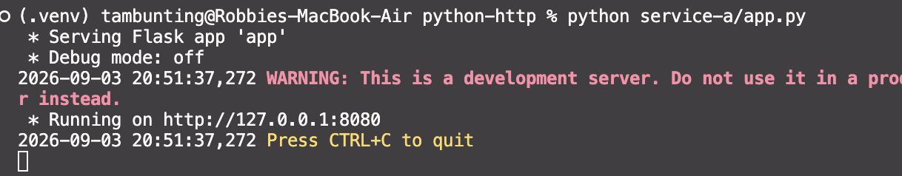
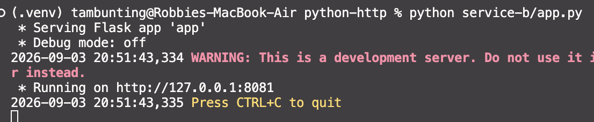
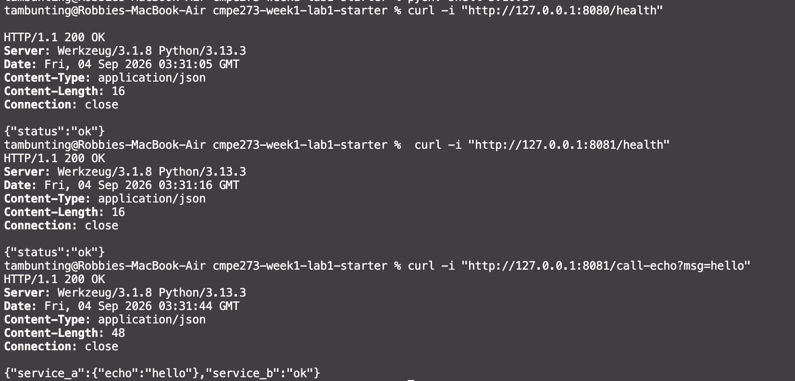
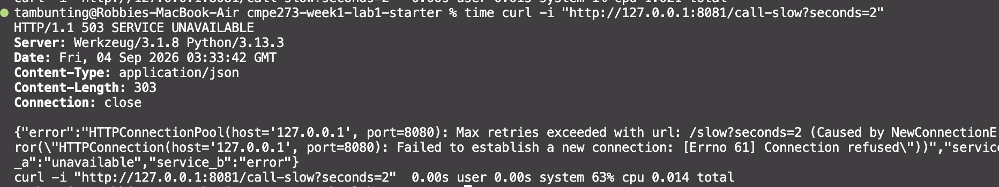
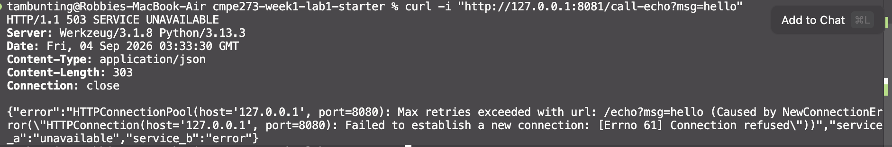

# Python HTTP Track

Two independent Flask processes: Service A (port 8080) is a simple echo API,
Service B (port 8081) calls Service A over HTTP with a timeout.

- **Service A** — `GET /health`, `GET /echo?msg=...`, `GET /slow?seconds=N`
(sleeps `N` seconds, clamped 0-10; exists only to trigger B's timeout).
- **Service B** — `GET /health`, `GET /call-echo?msg=...` (calls A's `/echo`),
`GET /call-slow?seconds=N` (calls A's `/slow`). Every call to A goes through
a shared 1-second `requests` timeout; any failure — timeout, refused
connection, or an error status from A — is logged and turned into a `503` .


## How to run locally

One shared virtualenv for both services (two terminals, one process each):

```bash
cd python-http
python3 -m venv .venv
source .venv/bin/activate
pip install -r service-a/requirements.txt -r service-b/requirements.txt
```

Terminal 1:

```bash
source .venv/bin/activate
python service-a/app.py
```



Terminal 2:

```bash
source .venv/bin/activate
python service-b/app.py
```



Each terminal prints one log line per request in the form
`service=<A|B> endpoint=<path> status=<http_code> latency_ms=<n>`
(errors also include `error="..."`).

## Success proof

```
$ curl -i "http://127.0.0.1:8080/health"
HTTP/1.1 200 OK
{"status":"ok"}

$ curl -i "http://127.0.0.1:8081/health"
HTTP/1.1 200 OK
{"status":"ok"}

$ curl -i "http://127.0.0.1:8081/call-echo?msg=hello"
HTTP/1.1 200 OK
{"service_a":{"echo":"hello"},"service_b":"ok"}
```

Corresponding logs:

```
service=A endpoint=/health status=200 latency_ms=0
service=B endpoint=/health status=200 latency_ms=0
service=A endpoint=/echo   status=200 latency_ms=0
service=B endpoint=/call-echo status=200 latency_ms=5
```



## Timeout proof

Service B's timeout is 1 second; Service A's `/slow?seconds=2` sleeps for 2,
so the call to it always times out:

```
$ time curl -i "http://127.0.0.1:8081/call-slow?seconds=2"
HTTP/1.1 503 SERVICE UNAVAILABLE
{"error":"HTTPConnectionPool(host='127.0.0.1', port=8080): Read timed out. (read timeout=1.0)","service_a":"unavailable","service_b":"error"}

real  0m1.019s
```

Log:

```
service=B endpoint=/call-slow status=503 error="HTTPConnectionPool(host='127.0.0.1', port=8080): Read timed out. (read timeout=1.0)" latency_ms=1002
```

The response comes back in ~1s (bounded by the timeout), not ~2s (how long A
was actually sleeping) — confirming B doesn't wait on a hung dependency.



## Failure proof

Stop Service A (`Ctrl+C` in its terminal), then rerun the same call-echo curl:

```
$ curl -i "http://127.0.0.1:8081/call-echo?msg=hello"
HTTP/1.1 503 SERVICE UNAVAILABLE
{"error":"HTTPConnectionPool(host='127.0.0.1', port=8080): Max retries exceeded with url: /echo?msg=hello (Caused by NewConnectionError(\"HTTPConnection(host='127.0.0.1', port=8080): Failed to establish a new connection: [Errno 61] Connection refused\"))","service_a":"unavailable","service_b":"error"}
```



Service B's log shows the error clearly:

```
service=B endpoint=/call-echo status=503 error="HTTPConnectionPool(host='127.0.0.1', port=8080): Max retries exceeded with url: /echo?msg=hello (Caused by NewConnectionError(\"HTTPConnection(host='127.0.0.1', port=8080): Failed to establish a new connection: [Errno 61] Connection refused\"))" latency_ms=1
```


Service B itself stays up the whole time — its own `/health` still returns
`200` while A is down:

```
$ curl -i "http://127.0.0.1:8081/health"
HTTP/1.1 200 OK
{"status":"ok"}
```

Restarting Service A recovers `/call-echo` immediately, with no restart of B
needed.


## What makes this distributed?
